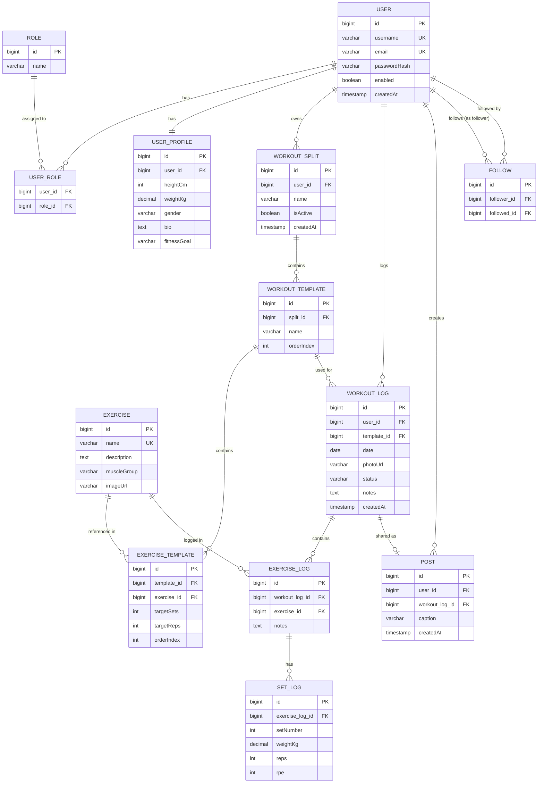

# WorkoutTracker

> Faculty project for the course **Web Applications with Microservices**

A full-stack workout tracking application built with Spring Boot and React.

---

## Functional Requirements

### Authentication & Authorization
- Users can register with a unique username, email, and password
- Users can log in and receive a JWT token valid for 24 hours
- All endpoints except exercise browsing and authentication require a valid JWT
- Two roles exist: `ROLE_USER` (default) and `ROLE_ADMIN`
- Admins can create, update, and delete exercises; regular users cannot

### User Profile
- Each user has a profile with optional fields: height, weight, gender, bio, and fitness goal
- Users can view and edit their own profile
- Users can view other users' public profiles

### Exercise Catalog
- Admins can add exercises with name, description, muscle group, and image URL
- All users (including unauthenticated) can browse and search exercises by name or filter by muscle group
- Exercise listing is paginated and sortable

### Workout Splits & Templates
- Users can create named workout splits (e.g. "Push/Pull/Legs")
- A user can have at most one active split at a time; activating a new split deactivates the current one
- Each split contains ordered workout day templates (e.g. "Push Day")
- Each template lists exercises from the global catalog with optional target sets and reps

### Workout Logging
- Users can create a workout log against a template from their active split, with a date and optional photo URL
- Users can add exercise logs and set logs (weight × reps, optional RPE 1–10) to a workout log
- Users can mark a workout log as **Completed**
- Users can view their full workout history, paginated and sorted by date

### Social Features
- Users can follow and unfollow other users (a user cannot follow themselves)
- Users can share a completed workout as a post with an optional caption
- Users can view a paginated feed of posts from users they follow
- Users can view another user's public posts and profile

---

## ERD Diagram



---

## Tech Stack

| Layer | Technology |
|---|---|
| Backend | Spring Boot 4.0.3, Java 21 |
| Frontend | React 19, TypeScript 5.9, Vite 8 |
| Database | PostgreSQL 17 |
| Auth | Spring Security + JWT (jjwt 0.13) |
| Styling | Tailwind CSS v4 |
| HTTP Client | Axios 1.13 |

---

## Prerequisites

- [Docker](https://www.docker.com/) & Docker Compose
- JDK 21
- Node.js 20+

---

## Getting Started

### 1. Clone the repository

```bash
git clone <repo-url>
cd WorkoutTracker
```

### 2. Configure environment variables

Create a `.env` file in the `WorkoutTracker/` root:

```env
JWT_SECRET=your-secret-key-at-least-32-characters-long
```

> `JWT_SECRET` has no default — the backend will refuse to start without it.

### 3. Start the database

```bash
docker compose up -d
```

### 4. Start the backend

```bash
cd backend
export $(cat ../.env | xargs) && ./gradlew bootRun
```

Backend runs on `http://localhost:8080`. Verify with:

```bash
curl http://localhost:8080/actuator/health
# {"status":"UP"}
```

### 5. Start the frontend

```bash
cd frontend
npm install
npm run dev
```

Frontend runs on `http://localhost:5173`. The Vite dev server proxies `/api/*` → `localhost:8080`.

---

## Project Structure

```
WorkoutTracker/
├── backend/
│   └── src/main/java/com/workout_tracker/backend/
│       ├── config/        # Security, CORS, beans
│       ├── controller/    # REST controllers
│       ├── dto/           # Request/response objects
│       ├── exception/     # Global error handling
│       ├── model/         # JPA entities
│       ├── repository/    # Spring Data repositories
│       └── service/       # Business logic
├── frontend/
│   └── src/
│       ├── api/           # Axios instances & API calls
│       ├── components/    # Reusable UI components
│       ├── context/       # React context providers
│       ├── hooks/         # Custom hooks
│       ├── pages/         # Route-level components
│       └── types/         # TypeScript interfaces
├── docker-compose.yml     # PostgreSQL service
└── .env                   # Local environment variables (not committed)
```

---

## Backend Dependencies

| Dependency | Purpose |
|---|---|
| `spring-boot-starter-webmvc` | REST API |
| `spring-boot-starter-data-jpa` | ORM / database access |
| `spring-boot-starter-security` | Authentication & authorization |
| `spring-boot-starter-validation` | Request validation |
| `spring-boot-starter-actuator` | Health & metrics endpoints |
| `jjwt-api / impl / jackson` | JWT token handling |
| `lombok` | Boilerplate reduction |
| `postgresql` | Production database driver |
| `h2` | In-memory database for tests |

## Frontend Dependencies

| Dependency | Purpose |
|---|---|
| `react` + `react-dom` | UI framework |
| `react-router` | Client-side routing |
| `axios` | HTTP requests to backend |
| `tailwindcss` | Utility-first styling |
